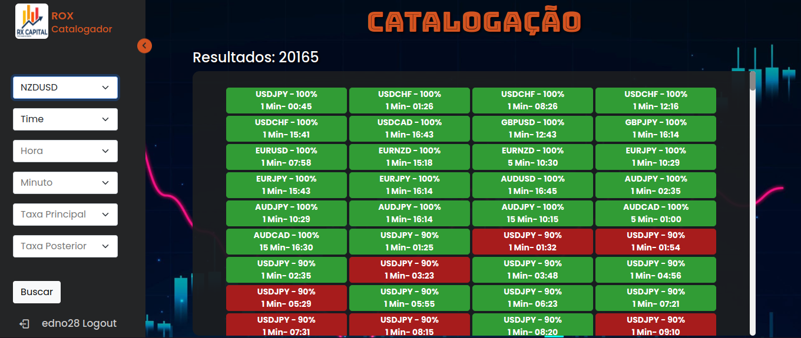
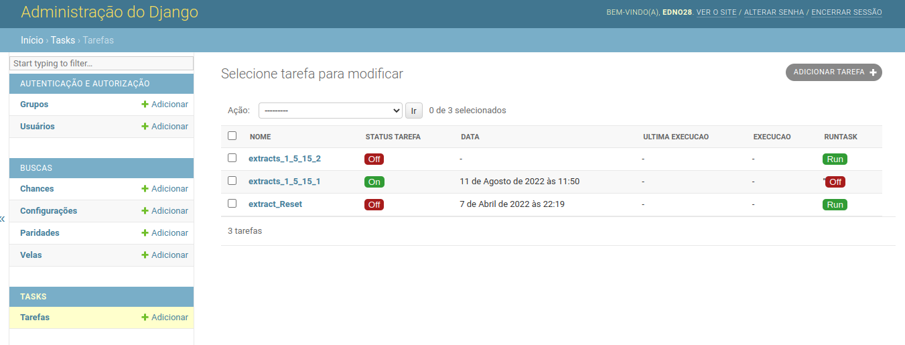
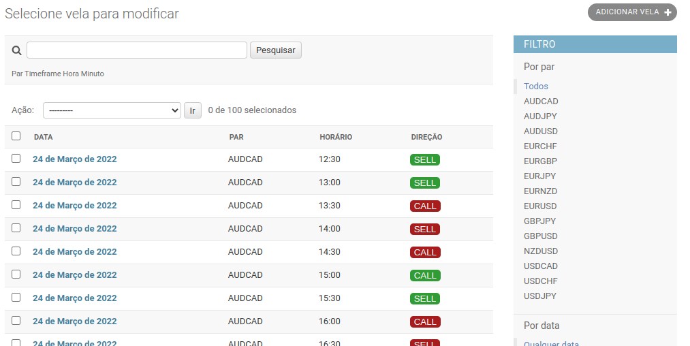

<p align="center">
  <a href="" rel="noopener">
 </a>
</p>

<h3 align="center">Catalogador Probabilístico</h3>

## Dependências:
- Iq Option API
- Django
- Apschedule


## 🧐 Sobre <a name = "about"></a>
Site feito em Django para catalogar as paridades da IQ Option e obter sinais probabilísticos.

## Frontend:
<p align="center">
 </>
</p>


## 📝 Features

- Sistema Tarefas (Execução de tarefas usando o painel admin do Django)
- 
  
- Modelo do resultado do backtest
-   


## ⛏️ Construido com <a name = "built_using"></a>

- Postgres 
- Django  
- Python

## Setup

```sh
pip install -r requirements.txt
python manage.py collectstatic
python manage.py runserver
```

## ✍️ Authors <a name = "authors"></a>

- [@Edno Almeida](https://github.com/edno2819) 
